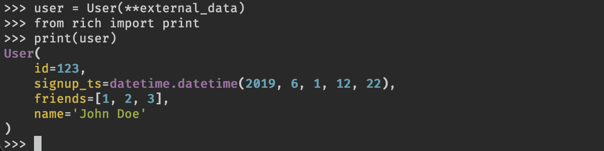



<!-- Pydantic models may be printed with the [Rich](https://github.com/willmcgugan/rich) library which will add additional formatting and color to the output. Here's an example: -->
Pydanticモデルは、[Rich](https://github.com/willmcgugan/rich)ライブラリで印刷することができ、出力に追加のフォーマットと色を追加します。以下に例を示します。

<!-- See the Rich documentation on [pretty printing](https://rich.readthedocs.io/en/latest/pretty.html) for more information. -->
詳細については、Rich documentation on[pretty printing](https://rich.readthedocs.io/en/latest/pretty.html)を参照してください。
