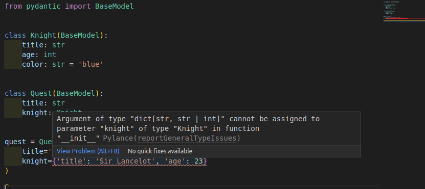



<!-- Pydantic works well with any editor or IDE out of the box because it's made on top of standard Python type annotations. -->
Pydanticは、標準のPython型アノテーションの上に作られているので、どんなエディタやIDEでもすぐに使えます。

<!-- When using [Visual Studio Code (VS Code)](https://code.visualstudio.com/), there are some **additional editor features** supported, comparable to the ones provided by the [PyCharm plugin](../integrations/pycharm.md). -->
[Visual Studio Code(VS Code)](https://code.visualstudio.com/)を使用すると、[PyCharm plugin](../integrations/PyCharm.md)で提供されているものに匹敵する、いくつかの**追加のエディタの機能**がサポートされます。

<!-- This means that you will have **autocompletion** (or "IntelliSense") and **error checks** for types and required arguments even while creating new Pydantic model instances. -->
これは、新しいPydanticモデルインスタンスを作成している間でも、型と必要な引数の**オートコンプリート**(または"IntelliSense")と**エラーチェック**ができることを意味します。


## Configure VS Code

<!-- To take advantage of these features, you need to make sure you configure VS Code correctly, using the recommended settings. -->
これらの機能を利用するには、推奨される設定を使用してVS Codeを正しく設定する必要があります。

<!-- In case you have a different configuration, here's a short overview of the steps. -->
異なる構成を使用している場合は、ここで手順の概要を簡単に説明します。

### Install Pylance

<!-- You should use the [Pylance](https://marketplace.visualstudio.com/items?itemName=ms-python.vscode-pylance) extension for VS Code. It is the recommended, next-generation, official VS Code plug-in for Python. -->
VS Codeには、[Pylance](https://marketplace.visualstudio.com/items?itemName=ms-python.vscode-pylance)エクステンションを使用する必要があります。これは、Python用の推奨される次世代の公式VS Codeプラグインです。

<!-- Pylance is installed as part of the [Python Extension for VS Code](https://marketplace.visualstudio.com/items?itemName=ms-python.python) by default, so it should probably just work. Otherwise, you can double check it's installed and enabled in your editor. -->
Pylanceはデフォルトで[Python Extension for VS Code](https://marketplace.visualstudio.com/items?itemName=ms-python.python)の一部としてインストールされているため、おそらく正常に動作するはずです。それ以外の場合は、エディタでインストールされて有効になっていることを再確認できます。

### Configure your environment

<!-- Then you need to make sure your editor knows the [Python environment](https://code.visualstudio.com/docs/python/python-tutorial#_install-and-use-packages) (probably a virtual environment) for your Python project. -->
次に、エディタがPythonプロジェクトの[Python environment](https://code.visualstudio.com/docs/python/python-tutorial#_install-and-use-packages)(おそらく仮想環境)を認識していることを確認する必要があります。

<!-- This would be the environment in where you installed Pydantic. -->
これは、Pydanticをインストールした環境です。

### Configure Pylance

<!-- With the default configurations, you will get support for autocompletion, but Pylance might not check for type errors. -->
デフォルトの構成では、オートコンプリートがサポートされますが、Pylanceは型エラーをチェックしない可能性があります。

<!-- You can enable type error checks from Pylance with these steps: -->
Pylanceからタイプエラーチェックを有効にするには、次の手順に従います。

* "User Settings"を開きます。
* `Type Checking Mode`を検索
* `Python'Analysis:Type Checking Mode`にオプションがあります。
* `basic`または`strict`に設定します(デフォルトでは`off`)


<!-- Now you will not only get autocompletion when creating new Pydantic model instances but also error checks for **required arguments**. -->
新しいPydanticモデルインスタンスを作成するときにオートコンプリートが得られるだけでなく、**必要な引数**のエラーチェックもできるようになりました。


<!-- And you will also get error checks for **invalid data types**. -->
また、**無効なデータ型**のエラーチェックも行われます。


!!! note "Technical Details"
    <!-- Pylance is the VS Code extension, it's closed source, but free to use. Underneath, Pylance uses an open source tool (also from Microsoft) called [Pyright](https://github.com/microsoft/pyright) that does all the heavy lifting. -->
    PylanceはVS Codeエクステンションであり、クローズドソースですが、無料で使用できる。そのもとで、Pylanceは[Pyright](https://github.com/microsoft/pyright)と呼ばれるオープンソースツール(これもMicrosoftから)を使用しており、大変な作業を行っています。

    <!-- You can read more about it in the [Pylance Frequently Asked Questions](https://github.com/microsoft/pylance-release/blob/main/FAQ.md#what-is-the-relationship-between-pylance-pyright-and-the-python-extension). -->
    詳細については、[Pylance Frequently Asked Questions](https://github.com/microsoft/pylance-release/blob/main/FAQ.md#what-is-the-relationship-between-pylance-pyright-and-the-python-extensions)を参照してください。

### Configure mypy

<!-- You might also want to configure mypy in VS Code to get mypy error checks inline in your editor (alternatively/additionally to Pylance). -->
また、VS Codeでmypyを設定して、エディタ内で(Pylanceの代わりに/追加として)mypyのエラーチェックをインラインで行うこともできます。

<!-- This would include the errors detected by the [Pydantic mypy plugin](../integrations/mypy.md), if you configured it. -->
[Pydantic mypy plugin](../integrations/mypy.md)が設定されていれば、それによって検出されたエラーも含まれます。

<!-- To enable mypy in VS Code, do the following: -->
VS Codeでmypyを有効にするには、次のようにします。

<!-- * Open the "User Settings"
* Search for `Mypy Enabled`
* You will find an option under `Python › Linting: Mypy Enabled`
* Check the box (by default it's unchecked) -->
* "User Settings"を開きます。
* `Mypy Enabled`を検索してください
* `Python'Linting:Mypy Enabled`にオプションがあります。
* チェックボックスをオンにします(デフォルトではオフになっています)。


## Tips and tricks

<!-- Here are some additional tips and tricks to improve your developer experience when using VS Code with Pydantic. -->
ここでは、PydanticでVSコードを使用する際の開発者エクスペリエンスを向上させるためのヒントとコツをいくつか紹介します。

### Strict errors

<!-- The way this additional editor support works is that Pylance will treat your Pydantic models as if they were Python's pure `dataclasses`. -->
この追加のエディタサポートが機能する方法は、PylanceがPydanticモデルをあたかもPythonの純粋な"データクラス"であるかのように扱うことです。

<!-- And it will show **strict type error checks** about the data types passed in arguments when creating a new Pydantic model instance. -->
また、新しいPydanticモデルインスタンスを作成するときに、引数で渡されるデータ型について**厳密な型エラーチェック**が表示されます。

<!-- In this example you can see that it shows that a `str` of `'23'` is not a valid `int` for the argument `age`. -->
この例では、`'23'`の`str`が引数`age`に対して有効な`int`ではないことを示しています。


It would expect `age=23` instead of `age='23'`.

<!-- Nevertheless, the design, and one of the main features of Pydantic, is that it is very **lenient with data types**. -->
それにもかかわらず、Pydanticの設計と主な特徴の1つは、データ型に対して非常に**寛大である**ことです。

<!-- It will actually accept the `str` with value `'23'` and will convert it to an `int` with value `23`. -->
実際には、値が`'23'`の`str`を受け入れ、値が`23`の`int`に変換します。

<!-- These strict error checks are **very useful** most of the time and can help you **detect many bugs early**. But there are cases, like with `age='23'`, where they could be inconvenient by reporting a "false positive" error. -->
これらの厳密なエラーチェックは、ほとんどの場合**非常に有用**であり、**多くのバグを早期に検出**するのに役立ちます。しかし、`age='23'`のように、"誤検出"エラーを報告することで不便になる場合もあります。

---

<!-- This example above with `age='23'` is intentionally simple, to show the error and the differences in types. -->
上の例の`age='23'`は、エラーと型の違いを示すために意図的に単純になっています。

<!-- But more common cases where these strict errors would be inconvenient would be when using more sophisticated data types, like `int` values for `datetime` fields, or `dict` values for Pydantic sub-models. -->
しかし、これらの厳密なエラーが不便であるより一般的なケースは、`datetime`フィールドの`int`値やPydanticサブモデルの`dict`値のような、より洗練されたデータ型を使用する場合です。

<!-- For example, this is valid for Pydantic: -->
たとえば、次の例はPydanticに有効です。

```Python hl_lines="12 17"
from pydantic import BaseModel


class Knight(BaseModel):
    title: str
    age: int
    color: str = 'blue'


class Quest(BaseModel):
    title: str
    knight: Knight


quest = Quest(
    title='To seek the Holy Grail', knight={'title': 'Sir Lancelot', 'age': 23}
)
```

<!-- The type of the field `knight` is declared with the class `Knight` (a Pydantic model) and the code is passing a literal `dict` instead. This is still valid for Pydantic, and the `dict` would be automatically converted to a `Knight` instance. -->
フィールド`knight`の型はクラス`Knight`(Pydanticモデル)で宣言され、コードは代わりにリテラル`dict`を渡しています。これはPydanticでも有効で、`dict`は自動的に`Knight`インスタンスに変換されます。

<!-- Nevertheless, it would be detected as a type error: -->
それにもかかわらず、型エラーとして検出されます。



<!-- In those cases, there are several ways to disable or ignore strict errors in very specific places, while still preserving them in the rest of the code. -->
このような場合、特定の場所での厳密なエラーを無効にしたり無視したりする方法がいくつかありますが、コードの残りの部分ではそのまま保持されます。

<!-- Below are several techniques to achieve it. -->
これを実現するためのいくつかのテクニックを以下に示します。

#### Disable type checks in a line

<!-- You can disable the errors for a specific line using a comment of: -->
次のコメントを使用して、特定の行のエラーを無効にできます。

```py
# type: ignore
```

<!-- or (to be specific to pylance/pyright): -->
または(pylance/pyrightに固有):

```py
# pyright: ignore
```

<!-- ([pyright](https://github.com/microsoft/pyright) is the language server used by Pylance.). -->
([pyright](https://github.com/microsoft/pyright)はPylanceで使用されている言語サーバーです。

<!-- coming back to the example with `age='23'`, it would be: -->
`age='23'`の例に戻ると、次のようになります。

```Python hl_lines="10"
from pydantic import BaseModel


class Knight(BaseModel):
    title: str
    age: int
    color: str = 'blue'


lancelot = Knight(title='Sir Lancelot', age='23')  # pyright: ignore
```

<!-- that way Pylance and mypy will ignore errors in that line. -->
そうすれば、Pylanceとmypyはその行のエラーを無視します。

<!-- **Pros**: it's a simple change in that line to remove errors there. -->
**長所**: その行のエラーを削除するための簡単な変更です。

<!-- **Cons**: any other error in that line will also be omitted, including type checks, misspelled arguments, required arguments not provided, etc. -->
**短所**: 型チェック、引数のスペルミス、必要な引数が指定されていないなど、その行のその他のエラーも省略されます。

#### Override the type of a variable

<!-- You can also create a variable with the value you want to use and declare its type explicitly with `Any`. -->
使用したい値を持つ変数を作成し、その型を`Any`で明示的に宣言することもできます。

```Python hl_lines="1 11-12"
from typing import Any

from pydantic import BaseModel


class Knight(BaseModel):
    title: str
    age: int
    color: str = 'blue'


age_str: Any = '23'
lancelot = Knight(title='Sir Lancelot', age=age_str)
```

<!-- that way Pylance and mypy will interpret the variable `age_str` as if they didn't know its type, instead of knowing it has a type of `str` when an `int` was expected (and then showing the corresponding error). -->
そうすれば、Pylanceとmypyは変数`age_str`を、その型を知らないかのように解釈します。`int`が予期されていたときに、変数が`str`型であることを知る(そして対応するエラーを表示する)のではありません。

<!-- **Pros**: errors will be ignored only for a specific value, and you will still see any additional errors for the other arguments. -->
**長所**: エラーは特定の値に対してのみ無視され、その他の引数に対しては追加のエラーが表示されます。

<!-- **Cons**: it requires importing `Any` and a new variable in a new line for each argument that needs ignoring errors. -->
**短所**: エラーを無視する必要がある引数ごとに、`Any`と新しい変数を新しい行にインポートする必要があります。

#### Override the type of a value with `cast`

<!-- The same idea from the previous example can be put on the same line with the help of `cast()`. -->
前の例と同じ考え方を`cast()`を使って同じ行に置くことができます。

<!-- This way, the type declaration of the value is overridden inline, without requiring another variable. -->
このようにして、別の変数を必要とせずに、値の型宣言がインラインでオーバーライドされます。

```Python hl_lines="1 11"
from typing import Any, cast

from pydantic import BaseModel


class Knight(BaseModel):
    title: str
    age: int
    color: str = 'blue'


lancelot = Knight(title='Sir Lancelot', age=cast(Any, '23'))
```

<!-- `cast(Any, '23')` doesn't affect the value, it's still just `'23'`, but now Pylance and mypy will assume it is of type `Any`, which means, they will act as if they didn't know the type of the value. -->
`cast(Any, '23')`は値に影響せず、ただの`'23'`ですが、Pylanceとmypyはそれが`Any`型であると仮定します。つまり、値の型を知らないかのように動作します。

<!-- So, this is the equivalent of the previous example, without the additional variable. -->
つまり、これは前の例と同じですが、変数が追加されていません。

<!-- **Pros**: errors will be ignored only for a specific value, and you will still see any additional errors for the other arguments. There's no need for additional variables. -->
**長所**: エラーは特定の値に対してのみ無視され、その他の引数に対しては追加のエラーが表示されます。追加の変数は必要ありません。

<!-- **Cons**: it requires importing `Any` and `cast`, and if you are not used to using `cast()`, it could seem strange at first. -->
**短所**: `Any`と`cast`をインポートする必要があり、`cast()`の使用に慣れていないと、最初は奇妙に思えるかもしれません。

### Config in class arguments

<!-- Pydantic has a rich set of [Model Configurations][pydantic.config.ConfigDict] available. -->
Pydanticには豊富な[Model Configurations][pydantic.config.ConfigDict]が用意されています。

<!-- These configurations can be set in an internal `class Config` on each model: -->
これらの設定は、各モデルの内部`class Config`で設定できます。

```Python hl_lines="9-10"
from pydantic import BaseModel


class Knight(BaseModel):
    model_config = dict(frozen=True)
    title: str
    age: int
    color: str = 'blue'
```

<!-- or passed as keyword arguments when defining the model class: -->
または、モデルクラスを定義するときにキーワード引数として渡されます。

```Python hl_lines="4"
from pydantic import BaseModel


class Knight(BaseModel, frozen=True):
    title: str
    age: int
    color: str = 'blue'
```

<!-- The specific configuration **`frozen`** (in beta) has a special meaning. -->
特定の設定**`frozen`**(ベータ版)には特別な意味があります。

<!-- It prevents other code from changing a model instance once it's created, keeping it **"frozen"**. -->
一度作成されたモデルインスタンスを他のコードが変更するのを防ぎ、**"frozen"**されたままにします。

<!-- When using the second version to declare `frozen=True` (with **keyword arguments** in the class definition), Pylance can use it to help you check in your code and **detect errors** when something is trying to set values in a model that is "frozen". -->
2番目のバージョンを使用して`frozen=True`(クラス定義で**キーワード引数**を使用)を宣言すると、Pylanceはコードをチェックインし、"frozen"のモデルに値を設定しようとしたときに**エラーを検出**するのに役立ちます。


## Adding a default with `Field`

<!-- Pylance/pyright requires `default` to be a keyword argument to `Field` in order to infer that the field is optional. -->
Pylance/pyrightでは、フィールドがオプションであることを推測するために、`default`を`Field`のキーワード引数にする必要があります。

```py
from pydantic import BaseModel, Field


class Knight(BaseModel):
    title: str = Field(default='Sir Lancelot')  # this is okay
    age: int = Field(
        23
    )  # this works fine at runtime but will case an error for pyright


lance = Knight()  # error: Argument missing for parameter "age"
```

<!-- This is a limitation of dataclass transforms and cannot be fixed in pydantic. -->
これはデータクラス変換の制限であり、pydanticでは修正できません。

## Technical Details

!!! warning
    <!-- As a Pydantic user, you don't need the details below. Feel free to skip the rest of this section. -->
    Pydanticユーザーであれば、以下の詳細は必要ありません。このセクションの残りの部分は自由にスキップしてください。

    <!-- These details are only useful for other library authors, etc. -->
    これらの詳細は、他のライブラリ作成者などにとってのみ有用である。

<!-- This additional editor support works by implementing the proposed draft standard for [Dataclass Transform (PEP 681)](https://peps.python.org/pep-0681/). -->
この追加のエディタサポートは、[Dataclass Transform(PEP 681)](https://peps.python.org/pep-0681/)の提案されたドラフト標準を実装することによって機能する。

<!-- The proposed draft standard is written by Eric Traut, from the Microsoft team, the same author of the open source package Pyright (used by Pylance to provide Python support in VS Code). -->
提案されたドラフト標準は、オープンソースパッケージPyright(PylanceがVS Codeでパイソンサポートを提供するために使用している)の同じ著者であるMicrosoftチームのEric Trautによって書かれています。

<!-- The intention of the standard is to provide a way for libraries like Pydantic and others to tell editors and tools that they (the editors) should treat these libraries (e.g. Pydantic) as if they were `dataclasses`, providing autocompletion, type checks, etc. -->
この標準の意図は、Pydanticやその他のライブラリが、エディタやツールに対して、それら(エディタ)がこれらのライブラリ(例えばPydantic)をあたかも"データクラス"であるかのように扱うべきであることを伝え、オートコンプリートや型チェックなどを提供する方法を提供することです。

<!-- The draft standard also includes an [Alternate Form](https://github.com/microsoft/pyright/blob/master/specs/dataclass_transforms.md#alternate-form) for early adopters, like Pydantic, to add support for it right away, even before the new draft standard is finished and approved. -->
ドラフト標準には、[Alternate Form](https://github.com/microsoft/pyright/blob/master/specs/dataclass_transformations.md#alternate-form)も含まれており、Pydanticなどのアーリーアダプタが、新しいドラフト標準が完成して承認される前であっても、すぐにサポートを追加できるようになっています。

<!-- This new draft standard, with the Alternate Form, is already supported by Pyright, so it can be used via Pylance in VS Code. -->
Alternate Formを含むこの新しいドラフト標準は、すでにPyrightでサポートされているため、VS CodeのPylanceを介して使用できます。

<!-- As it is being proposed as an official standard for Python, other editors can also easily add support for it. -->
Pythonの公式標準として提案されているので、他のエディタも簡単にサポートを追加できます。

<!-- And authors of other libraries similar to Pydantic can also easily adopt the standard right away (using the "Alternate Form") and get the benefits of these additional editor features. -->
また、Pydanticに似た他のライブラリーの作成者も、("Alternate Form"を使用して)この標準をすぐに簡単に採用し、これらの追加エディター機能の利点を得ることができます。
